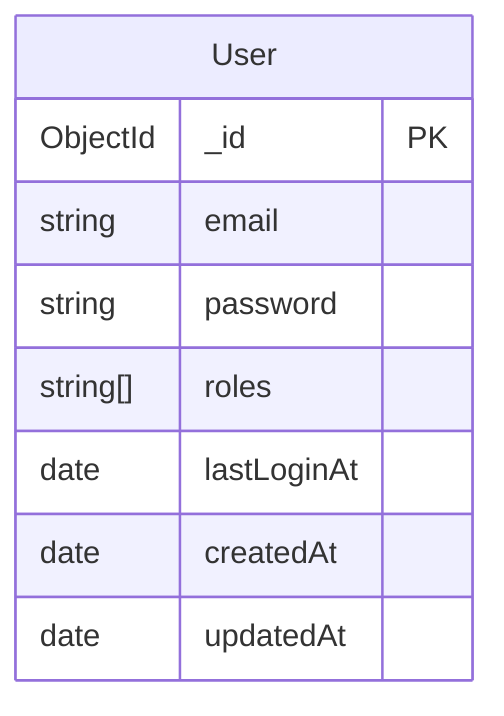

# Auth Service

## 엔티티 관계도 (ERD)

## 엔티티 상세 설명

### User (사용자)

- `_id`: 고유 식별자 (MongoDB ObjectId)
- `email`: 사용자 이메일 (unique, 인덱스 적용)
- `password`: 암호화된 비밀번호
- `roles`: 사용자 권한 목록
  - 기본값: ['user']
  - 가능한 값: ['user', 'admin']
- `lastLoginAt`: 마지막 로그인 시간
- `createdAt`: 생성 시간
- `updatedAt`: 마지막 수정 시간

### AUTH

#### 인증 전략: 쿠키 기반 인증

인증 서비스는 다음과 같은 이유로 쿠키 기반 인증을 사용합니다:

1. **동일 출처 보안**

   - 대부분의 서비스(이벤트 등)가 동일한 도메인에서 제공될 예정
   - 쿠키는 동일 도메인에 대한 요청에 자동으로 포함됨

2. **향상된 보안**

   - `httpOnly` 플래그로 JavaScript에서 토큰 접근 방지
   - `secure` 플래그로 HTTPS 통신에서만 토큰 전송
   - `sameSite: strict`로 CSRF 공격 방지
   - 토큰이 응답 본문이나 localStorage에 노출되지 않음

3. **자동 토큰 관리**

   - 브라우저가 자동으로 쿠키 만료 처리
   - 클라이언트 측 토큰 저장 로직 불필요
   - XSS 공격을 통한 토큰 유출 위험 감소

4. **단순화된 클라이언트 구현**
   - 요청에 토큰을 수동으로 첨부할 필요 없음
   - 자동 토큰 갱신 처리
   - 원활한 인증으로 향상된 사용자 경험

서비스는 두 가지 유형의 쿠키를 사용합니다:

- 액세스 토큰 (15분 만료)
- 리프레시 토큰 (7일 만료)
