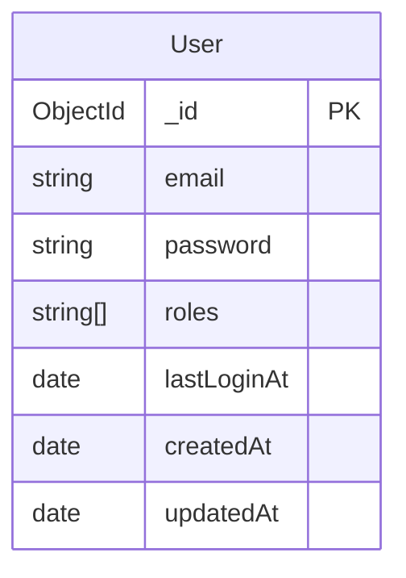

# Auth Service

## 엔티티 관계도 (ERD)

## 엔티티 상세 설명

### User (사용자)

- `_id`: 고유 식별자 (MongoDB ObjectId)
- `email`: 사용자 이메일 (unique, 인덱스 적용)
- `password`: 암호화된 비밀번호
- `roles`: 사용자 권한 목록
  - 기본값: ['user']
  - 가능한 값: ['user', 'admin']
- `lastLoginAt`: 마지막 로그인 시간
- `createdAt`: 생성 시간
- `updatedAt`: 마지막 수정 시간
