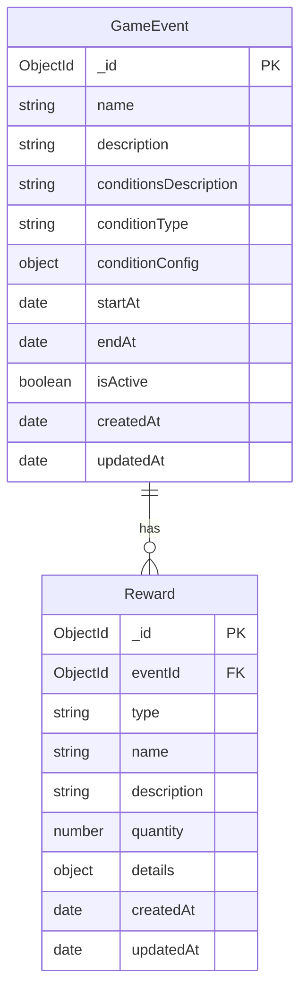

# Event Service

## 엔티티 관계도 (ERD)



## 관계 설계 결정 사항

Event와 Reward의 관계를 1:N(일대다)으로 설계한 이유는 다음과 같습니다:

### 1. 보상의 재사용성 고려

- 동일한 아이템이나 재화라도 이벤트마다 다른 이름과 설명이 필요할 수 있습니다.
- 예를 들어, 같은 "1000 포인트"라도 "신규 유저 환영 포인트"와 "이벤트 참여 보상 포인트"로 다르게 표현될 수 있습니다.
- 이러한 유연한 커스터마이징이 필요한 경우, 1:N 관계가 더 적합합니다.

### 2. 복잡성 vs 이점

- 보상의 재사용성이 낮은 경우, N:M 관계의 복잡성이 이점보다 더 큰 부담이 될 수 있습니다.
- 초기 구현 단계에서는 단순하고 명확한 구조가 더 효율적입니다.

### 3. 향후 확장성

- 만약 나중에 보상 템플릿의 재사용성이 중요해진다면, N:M 관계로 리팩토링할 수 있습니다.
- 현재 구조에서도 동일한 보상 내용을 여러 이벤트에서 사용할 수 있으며, 각각의 이벤트별로 독립적인 설정이 가능합니다.

## 엔티티 상세 설명

### GameEvent (게임 이벤트)

- `_id`: 고유 식별자 (MongoDB ObjectId)
- `name`: 이벤트 이름 (인덱스 적용)
- `description`: 이벤트 상세 설명
- `conditionsDescription`: 이벤트 조건에 대한 사람이 읽을 수 있는 설명
- `conditionType`: 이벤트 유형 분류 (인덱스 적용)
- `conditionConfig`: 이벤트 조건 설정
  - 복합 조건 또는 기본 조건 배열로 구성 가능
  - 복합 조건 구조:
    ```typescript
    {
      operator: 'AND' | 'OR',
      rules: [
        { type: string, params: Record<string, unknown> }
      ]
    }
    ```
- `startAt`: 이벤트 시작일
- `endAt`: 이벤트 종료일
- `isActive`: 현재 활성화 상태 여부 (인덱스 적용)
- `createdAt`: 생성 시간
- `updatedAt`: 마지막 수정 시간

### Reward (보상)

- `_id`: 고유 식별자 (MongoDB ObjectId)
- `eventId`: 연관된 게임 이벤트 참조 (인덱스 적용)
- `type`: 보상 유형 (enum: 'point', 'item', 'coupon')
- `name`: 보상 이름
- `description`: 선택적 상세 설명
- `quantity`: 획득 가능한 횟수
- `details`: 보상 유형별 상세 정보
  - 포인트 보상:
    ```typescript
    {
      pointAmount: number,
      expiryDate?: Date
    }
    ```
  - 아이템 보상:
    ```typescript
    {
      itemId: string,
      itemName: string,
      itemQuantity: number
    }
    ```
  - 쿠폰 보상:
    ```typescript
    {
      couponCode: string,
      discountAmount: number,
      discountType: 'percentage' | 'fixed',
      minimumPurchaseAmount?: number,
      expiryDate?: Date
    }
    ```
- `createdAt`: 생성 시간
- `updatedAt`: 마지막 수정 시간
