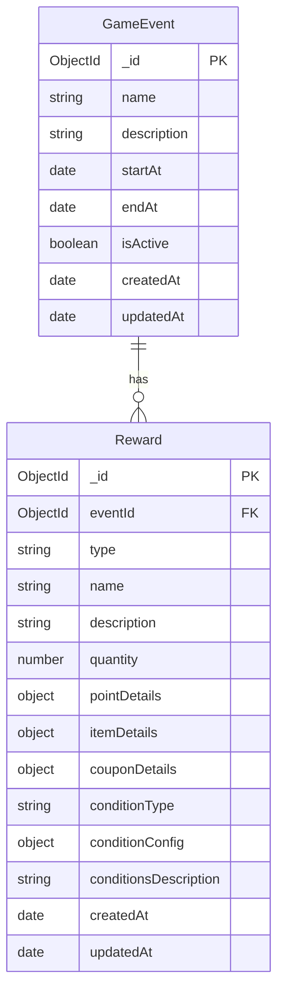

# Event Service

## 엔티티 관계도 (ERD)



## 관계 설계 결정 사항

Event와 Reward의 관계를 1:N(일대다)으로 설계한 이유는 다음과 같습니다:

### 1. 보상의 재사용성 고려

- 동일한 아이템이나 재화라도 이벤트마다 다른 이름과 설명이 필요할 수 있습니다.
- 예를 들어, 같은 "1000 포인트"라도 "신규 유저 환영 포인트"와 "이벤트 참여 보상 포인트"로 다르게 표현될 수 있습니다.
- 이러한 유연한 커스터마이징이 필요한 경우, 1:N 관계가 더 적합합니다.

## 엔티티 상세 설명

### GameEvent (게임 이벤트)

- `_id`: 고유 식별자 (MongoDB ObjectId)
- `name`: 이벤트 이름 (인덱스 적용)
- `description`: 이벤트 상세 설명
- `startAt`: 이벤트 시작일
- `endAt`: 이벤트 종료일
- `isActive`: 현재 활성화 상태 여부 (인덱스 적용)
- `createdAt`: 생성 시간
- `updatedAt`: 마지막 수정 시간

### Reward (보상)

- `_id`: 고유 식별자 (MongoDB ObjectId)
- `eventId`: 연관된 게임 이벤트 참조 (인덱스 적용)
- `type`: 보상 유형 (enum: 'point', 'item', 'coupon')
- `name`: 보상 이름
- `description`: 선택적 상세 설명
- `quantity`: 획득 가능한 횟수
- `pointDetails`: 포인트 보상 상세 정보
  ```typescript
  {
    pointAmount: number,
    expiryDate?: Date
  }
  ```
- `itemDetails`: 아이템 보상 상세 정보
  ```typescript
  {
    itemId: string,
    itemName: string,
    itemQuantity: number
  }
  ```
- `couponDetails`: 쿠폰 보상 상세 정보
  ```typescript
  {
    couponCode: string,
    discountAmount: number,
    discountType: 'percentage' | 'fixed',
    expiryDate?: Date
  }
  ```
- `conditionType`: 보상 조건 유형 (인덱스 적용)
- `conditionConfig`: 보상 조건 설정
- `conditionsDescription`: 보상 조건에 대한 사람이 읽을 수 있는 설명
- `createdAt`: 생성 시간
- `updatedAt`: 마지막 수정 시간
